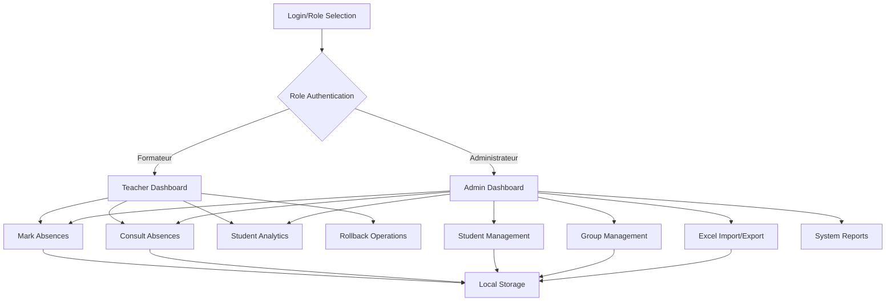

# Design Document: Enhanced User Management

## Overview

This design document outlines the architecture and implementation approach for enhancing the OFPPT Absence system with role-based authentication, comprehensive student management, rollback functionality, and visual analytics. The system will be built as an extension to the existing React application, maintaining the current single-file architecture while adding new components and state management patterns.

The enhancement introduces two distinct user roles (Formateur and Administrateur) with different permission levels, advanced student management capabilities including Excel import/export, absence rollback functionality, and visual analytics through interactive charts.

## Architecture

### High-Level Architecture



### Component Architecture

The system will extend the existing single-component architecture with new functional components:

- **RoleSelector**: Initial role selection interface
- **AuthenticationForm**: Enhanced login with role-specific validation
- **AdminDashboard**: Administrator-specific interface and navigation
- **TeacherDashboard**: Teacher-specific interface with limited permissions
- **StudentManager**: CRUD operations for student management
- **ExcelImporter**: File upload, validation, and import functionality
- **AbsenceAnalytics**: Chart-based visualization of absence data
- **RollbackManager**: Interface for undoing absence records
- **ReportGenerator**: Export and print functionality

## Components and Interfaces

### Authentication System

**RoleSelector Component**
```javascript
interface RoleSelector {
  roles: ['Formateur', 'Administrateur']
  onRoleSelect: (role: string) => void
  selectedRole: string | null
}
```

**Enhanced Authentication**
```javascript
interface AuthState {
  isAuthenticated: boolean
  userRole: 'Formateur' | 'Administrateur' | null
  username: string
  sessionId: string
  permissions: string[]
}

interface AuthActions {
  login: (username: string, password: string, role: string) => Promise<boolean>
  logout: () => void
  checkPermission: (permission: string) => boolean
}
```

### Student Management System

**Student Data Model**
```javascript
interface Student {
  cef: string // Unique identifier
  name: string
  email: string
  groupId: string
  disciplineScore: number
  createdAt: Date
  updatedAt: Date
}

interface Group {
  id: string
  name: string
  sectorId: string
  fieldId: string
  students: Student[]
  createdAt: Date
}
```

**Student Management Interface**
```javascript
interface StudentManager {
  addStudent: (student: Omit<Student, 'createdAt' | 'updatedAt'>) => Promise<void>
  updateStudent: (cef: string, updates: Partial<Student>) => Promise<void>
  deleteStudent: (cef: string) => Promise<void>
  importFromExcel: (file: File) => Promise<ImportResult>
  exportToExcel: (groupId?: string) => Promise<Blob>
}

interface ImportResult {
  success: boolean
  importedCount: number
  errors: ImportError[]
  preview: Student[]
}

interface ImportError {
  row: number
  field: string
  message: string
  value: any
}
```

### Absence Management Enhancements

**Enhanced Absence Model**
```javascript
interface AbsenceRecord {
  id: string
  studentCef: string
  date: Date
  duration: number // Hours (2.5, 5, or custom)
  isJustified: boolean
  recordedBy: string
  recordedAt: Date
  canRollback: boolean
  rollbackDeadline: Date
}

interface AbsenceSession {
  id: string
  date: Date
  recordedBy: string
  absences: AbsenceRecord[]
  createdAt: Date
}
```

**Rollback System**
```javascript
interface RollbackManager {
  canRollback: (absenceId: string) => boolean
  rollbackAbsence: (absenceId: string) => Promise<boolean>
  getRollbackableAbsences: (sessionId: string) => AbsenceRecord[]
  rollbackTimeLimit: number // Minutes
}
```

### Analytics and Reporting

**Analytics Data Model**
```javascript
interface StudentAnalytics {
  studentCef: string
  totalAbsences: number
  justifiedAbsences: number
  unjustifiedAbsences: number
  absencesByMonth: MonthlyAbsence[]
  attendanceRate: number
  trend: 'improving' | 'declining' | 'stable'
}

interface MonthlyAbsence {
  month: string
  year: number
  totalHours: number
  justifiedHours: number
  unjustifiedHours: number
}
```

**Chart Configuration**
```javascript
interface ChartConfig {
  type: 'line' | 'bar' | 'pie'
  data: ChartData
  options: ChartOptions
  responsive: boolean
}
```

## Data Models

### Enhanced Local Storage Schema

The system will extend the existing local storage structure:

```javascript
interface AppData {
  // Existing data
  sectors: Sector[]
  fields: Field[]
  groups: Group[]
  trainees: Student[] // Renamed from existing structure
  
  // New data structures
  users: User[]
  absenceSessions: AbsenceSession[]
  absenceRecords: AbsenceRecord[]
  systemSettings: SystemSettings
  auditLog: AuditEntry[]
}

interface User {
  username: string
  role: 'Formateur' | 'Administrateur'
  hashedPassword: string
  permissions: string[]
  lastLogin: Date
}

interface SystemSettings {
  rollbackTimeLimit: number
  maxImportSize: number
  exportFormats: string[]
  chartDefaults: ChartConfig
}

interface AuditEntry {
  id: string
  action: string
  userId: string
  timestamp: Date
  details: any
}
```

### Data Validation Rules

**Student Validation**
- CEF: Required, unique, alphanumeric, 6-12 characters
- Name: Required, 2-50 characters, letters and spaces only
- Email: Required, valid email format, unique
- Group: Required, must exist in system

**Excel Import Validation**
- File format: .xlsx or .xls only
- Maximum file size: 5MB
- Required columns: CEF, Name, Email, Group
- Maximum rows: 1000 per import
- Duplicate detection within file and against existing data

**Absence Validation**
- Duration: Must be 2.5, 5, or custom value between 0.5-8 hours
- Date: Cannot be future date, within current academic year
- Student: Must exist and be active

## Correctness Properties

*A property is a characteristic or behavior that should hold true across all valid executions of a system-essentially, a formal statement about what the system should do. Properties serve as the bridge between human-readable specifications and machine-verifiable correctness guarantees.*

Now I'll analyze the acceptance criteria to determine which ones can be tested as properties:

<function_calls>
<invoke name="prework">
<parameter name="featureName">enhanced-user-management

### Authentication and Authorization Properties

**Property 1: Role-based authentication consistency**
*For any* valid username, password, and role combination, successful authentication should grant access to exactly the features permitted for that role, and failed authentication should display appropriate errors while allowing role reselection.
**Validates: Requirements 1.4, 1.5**

**Property 2: Permission enforcement**
*For any* user session and feature access attempt, the system should allow access if and only if the user's role has the required permissions for that feature.
**Validates: Requirements 8.1, 8.2, 8.3, 8.4**

### Student Management Properties

**Property 3: Student data validation**
*For any* student creation or update attempt, the system should accept the data if and only if all required fields (CEF, name, email, group) are present, valid, and unique where required.
**Validates: Requirements 2.2**

**Property 4: Excel import validation and processing**
*For any* uploaded Excel file, the system should validate file format, check for duplicate CEF numbers, verify email formats, and either import all valid students or reject the entire import with detailed error reports.
**Validates: Requirements 2.3, 2.4, 2.5, 7.1, 7.2, 7.3, 7.4, 7.5**

**Property 5: Group management with referential integrity**
*For any* group deletion attempt containing students, the system should require confirmation and handle student reassignment while maintaining referential integrity with existing absence records.
**Validates: Requirements 2.7, 9.3**

### Absence Management Properties

**Property 6: Individual duration handling**
*For any* multi-student absence marking session, each student should be able to have an independently selected duration (2.5 hours, 5 hours, or custom), with custom durations validated within acceptable ranges.
**Validates: Requirements 4.1, 4.2, 4.3, 4.4**

**Property 7: Date range filtering accuracy**
*For any* date range filter applied to absence records, the displayed results should contain only absences with dates within the specified period (inclusive).
**Validates: Requirements 3.3**

**Property 8: Absence record completeness**
*For any* displayed absence record, all required information (student details, absence dates, duration, and justification status) should be clearly visible.
**Validates: Requirements 3.4, 4.5**

### Rollback System Properties

**Property 9: Rollback availability and execution**
*For any* absence record, rollback options should be available immediately after recording within the time limit, require confirmation before execution, and when completed should remove the record and update all related statistics.
**Validates: Requirements 5.1, 5.2, 5.3, 5.4, 5.5**

### Analytics and Reporting Properties

**Property 10: Chart data accuracy and differentiation**
*For any* student absence history graph, the visualization should accurately represent absences over time with clear differentiation between justified and unjustified absences, and include all required elements (date ranges, frequency, trends).
**Validates: Requirements 6.2, 6.3, 6.4**

**Property 11: Export format consistency**
*For any* absence record export request, the system should generate reports in both PDF and Excel formats with proper formatting, headers, and group information.
**Validates: Requirements 3.6, 3.7**

### Data Integrity Properties

**Property 12: Data consistency across operations**
*For any* data modification operation (create, update, delete, import), the system should validate data integrity before committing changes and maintain referential integrity across all related entities.
**Validates: Requirements 9.1, 9.4**

**Property 13: Rollback consistency**
*For any* completed rollback operation, all related statistics, reports, and derived data should be updated to reflect the removal of the absence record.
**Validates: Requirements 9.2**

## Error Handling

### Authentication Errors
- Invalid credentials: Display specific error message, maintain role selection
- Session expiration: Redirect to role selection with appropriate message
- Permission denied: Show permission error, redirect to appropriate dashboard

### Data Validation Errors
- Student validation: Field-specific error messages with validation rules
- Excel import errors: Row-by-row error reporting with specific issues
- File format errors: Clear messaging about supported formats and size limits

### System Errors
- Storage failures: Graceful degradation with user notification
- Concurrent modification conflicts: User notification with conflict resolution options
- Network/connectivity issues: Offline mode indicators and retry mechanisms

### Error Recovery Patterns
- Automatic retry for transient failures
- User-initiated retry options for recoverable errors
- Graceful fallbacks for non-critical features
- Data backup and recovery mechanisms

## Testing Strategy

### Dual Testing Approach

The system will employ both unit testing and property-based testing to ensure comprehensive coverage:

**Unit Tests** will focus on:
- Specific examples of authentication flows
- Edge cases in data validation (empty fields, boundary values)
- Error conditions and exception handling
- Integration points between components
- UI component rendering and interaction

**Property-Based Tests** will verify:
- Universal properties across all inputs using fast-check library
- Each property test will run minimum 100 iterations
- Authentication behavior across various credential combinations
- Data validation across randomly generated student data
- Excel import validation across various file formats and content
- Permission enforcement across different user roles and feature combinations
- Rollback functionality across different timing scenarios
- Chart generation accuracy across various absence data patterns

### Property Test Configuration

Each property-based test will be implemented using the fast-check library and tagged with comments referencing the design document properties:

```javascript
// Feature: enhanced-user-management, Property 1: Role-based authentication consistency
fc.assert(fc.property(
  fc.record({
    username: fc.string(),
    password: fc.string(),
    role: fc.constantFrom('Formateur', 'Administrateur')
  }),
  (credentials) => {
    // Test authentication consistency
  }
), { numRuns: 100 });
```

### Testing Libraries and Tools

- **Jest**: Primary testing framework for unit tests
- **React Testing Library**: Component testing and user interaction simulation
- **fast-check**: Property-based testing library for JavaScript
- **xlsx**: Excel file manipulation for import/export testing
- **Chart.js**: Chart rendering and data visualization testing

### Test Organization

Tests will be co-located with source files using `.test.jsx` suffix:
- `src/components/RoleSelector.test.jsx`
- `src/components/StudentManager.test.jsx`
- `src/components/ExcelImporter.test.jsx`
- `src/components/AbsenceAnalytics.test.jsx`
- `src/utils/validation.test.jsx`
- `src/utils/permissions.test.jsx`

Property-based tests will be organized in dedicated files:
- `src/tests/properties/authentication.properties.test.jsx`
- `src/tests/properties/student-management.properties.test.jsx`
- `src/tests/properties/absence-management.properties.test.jsx`
- `src/tests/properties/data-integrity.properties.test.jsx`